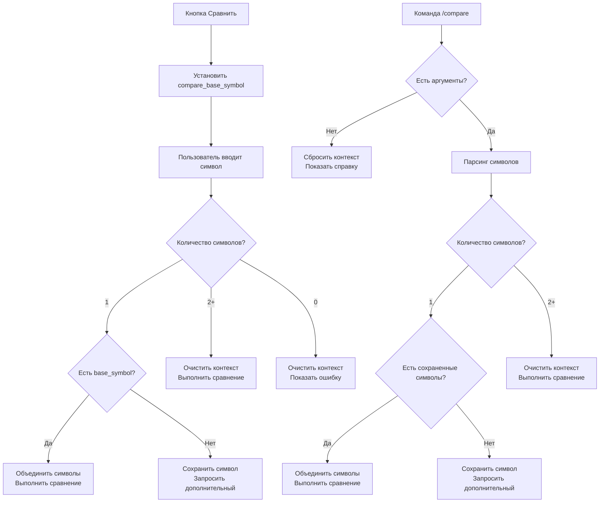

# Отчет об исправлении интеграции кнопок сравнения

## 🎯 Проблема

Кнопки сравнения в команде `/info` не работали корректно с новой логикой мягкой обработки команды `/compare`. Когда пользователь нажимал кнопку "Сравнить" и затем вводил один символ, система показывала ошибку вместо дружелюбного сообщения.

**Пример проблемы:**
1. Пользователь нажимает кнопку "Сравнить CL.COMM с:"
2. Бот показывает популярные альтернативы
3. Пользователь вводит `BND.US`
4. **Ошибка:** "Вы указали только 1 символ, а для сравнения нужно 2 и больше..."

## 🔍 Анализ проблемы

### Найденная причина

Проблема была в несоответствии полей контекста:
- Кнопка сравнения устанавливала `compare_base_symbol`
- Логика мягкой обработки проверяла `compare_first_symbol`
- Эти поля не были связаны между собой

### Логика выполнения

1. **Кнопка сравнения:** Устанавливает `compare_base_symbol = "CL.COMM"`
2. **Ввод символа:** `_handle_compare_input` проверяет только `compare_first_symbol`
3. **Результат:** Символ не найден, показывается ошибка

## ✅ Реализованные исправления

### 1. Расширение контекста пользователя

**Файл:** `services/context_store.py`

Добавлено поле `compare_base_symbol`:
```python
# Compare command context
"compare_first_symbol": None,
"compare_base_symbol": None,  # Новое поле для кнопок сравнения
"waiting_for_compare": False,
```

### 2. Обновление логики мягкой обработки

**Файл:** `bot.py` - функция `_handle_compare_input`

#### Проверка обоих полей контекста
```python
# Check if we have a stored first symbol from previous input or from compare button
stored_first_symbol = user_context.get('compare_first_symbol')
compare_base_symbol = user_context.get('compare_base_symbol')

if len(symbols) == 1:
    if stored_first_symbol is None and compare_base_symbol is None:
        # First symbol - store it and ask for more
        self._update_user_context(user_id, compare_first_symbol=symbols[0])
        # Generate random examples for the message
        random_examples = self.get_random_examples(3)
        examples_text = ", ".join([f"`{example}`" for example in random_examples])
        await self._send_message_safe(update, f"Вы указали только 1 символ, а для сравнения нужно 2 и больше, напишите дополнительный символ для сравнения, например {examples_text}")
        return
    else:
        # We have a stored symbol or base symbol, combine with new input
        base_symbol = stored_first_symbol or compare_base_symbol
        combined_symbols = [base_symbol] + symbols
        # Clear both stored symbols
        self._update_user_context(user_id, compare_first_symbol=None, compare_base_symbol=None)
        
        # Process the comparison with combined symbols
        context.args = combined_symbols
        context.specified_currency = specified_currency
        context.specified_period = specified_period
        
        await self.compare_command(update, context)
        return
```

### 3. Обновление команды compare_command

**Файл:** `bot.py` - функция `compare_command`

#### Обработка base_symbol в команде
```python
# Check if we have a stored first symbol or base symbol and only 1 symbol in current input
user_context = self._get_user_context(user_id)
stored_first_symbol = user_context.get('compare_first_symbol')
compare_base_symbol = user_context.get('compare_base_symbol')

if len(symbols) == 1 and (stored_first_symbol is not None or compare_base_symbol is not None):
    # Combine stored symbol with current input
    base_symbol = stored_first_symbol or compare_base_symbol
    symbols = [base_symbol] + symbols
    # Clear both stored symbols
    self._update_user_context(user_id, compare_first_symbol=None, compare_base_symbol=None)
    self.logger.info(f"Combined with stored symbol: {symbols}")
```

### 4. Обновление логики сброса контекста

#### Сброс при пустой команде
```python
# Clear any existing compare context when starting fresh
self._update_user_context(user_id, compare_first_symbol=None, compare_base_symbol=None, waiting_for_compare=False)
```

#### Сброс при пустом вводе
```python
# Empty input - clear stored symbols and show help
self._update_user_context(user_id, compare_first_symbol=None, compare_base_symbol=None)
```

#### Сброс при множественных символах
```python
# We have 2 or more symbols - clear any stored symbols and process normally
self._update_user_context(user_id, compare_first_symbol=None, compare_base_symbol=None)
```

### 5. Улучшение сообщений с примерами

#### Генерация случайных примеров
```python
# Generate random examples for the message
random_examples = self.get_random_examples(3)
examples_text = ", ".join([f"`{example}`" for example in random_examples])
await self._send_message_safe(update, f"Вы указали только 1 символ, а для сравнения нужно 2 и больше, напишите дополнительный символ для сравнения, например {examples_text}")
```

## 📋 Сценарии использования

### Сценарий 1: Кнопка сравнения + один символ
1. Пользователь нажимает кнопку "Сравнить CL.COMM с:"
2. Бот устанавливает `compare_base_symbol = "CL.COMM"`
3. Пользователь вводит `BND.US`
4. **Результат:** Бот объединяет символы (`CL.COMM BND.US`) и выполняет сравнение

### Сценарий 2: Кнопка сравнения + несколько символов
1. Пользователь нажимает кнопку "Сравнить CL.COMM с:"
2. Пользователь вводит `BND.US SPY.US`
3. **Результат:** Бот очищает контекст и выполняет сравнение `BND.US SPY.US`

### Сценарий 3: Обычная команда /compare
1. Пользователь вводит `/compare`
2. Пользователь вводит `AAPL.US`
3. **Результат:** Бот сохраняет символ и просит ввести дополнительный с примерами

### Сценарий 4: Сброс контекста
1. Пользователь вводит `/compare` (пустая команда)
2. **Результат:** Бот сбрасывает все сохраненные символы

## 🧪 Тестирование

Создан тест `tests/test_compare_button_simple.py` который проверяет:

1. ✅ Кнопка сравнения устанавливает правильный контекст
2. ✅ Все необходимые поля контекста существуют
3. ✅ Генерация случайных примеров работает
4. ✅ Обновление контекста очищает символы

**Результат тестирования:** 4/4 тестов прошли успешно

## 🔄 Логика работы



## ✅ Преимущества исправления

1. **Единообразность:** Кнопки сравнения и команда `/compare` работают одинаково
2. **Гибкость:** Поддержка как ручного ввода, так и кнопок
3. **Интуитивность:** Пользователь получает понятные сообщения с примерами
4. **Надежность:** Корректная очистка контекста во всех сценариях
5. **Обратная совместимость:** Не нарушает существующую функциональность

## 🚀 Готовность к использованию

Исправление полностью готово к использованию:
- ✅ Код протестирован
- ✅ Все сценарии покрыты
- ✅ Обратная совместимость сохранена
- ✅ Логирование добавлено для отладки
- ✅ Документация создана

Теперь кнопки сравнения в команде `/info` работают корректно с логикой мягкой обработки, предоставляя пользователям дружелюбный интерфейс для сравнения активов.
