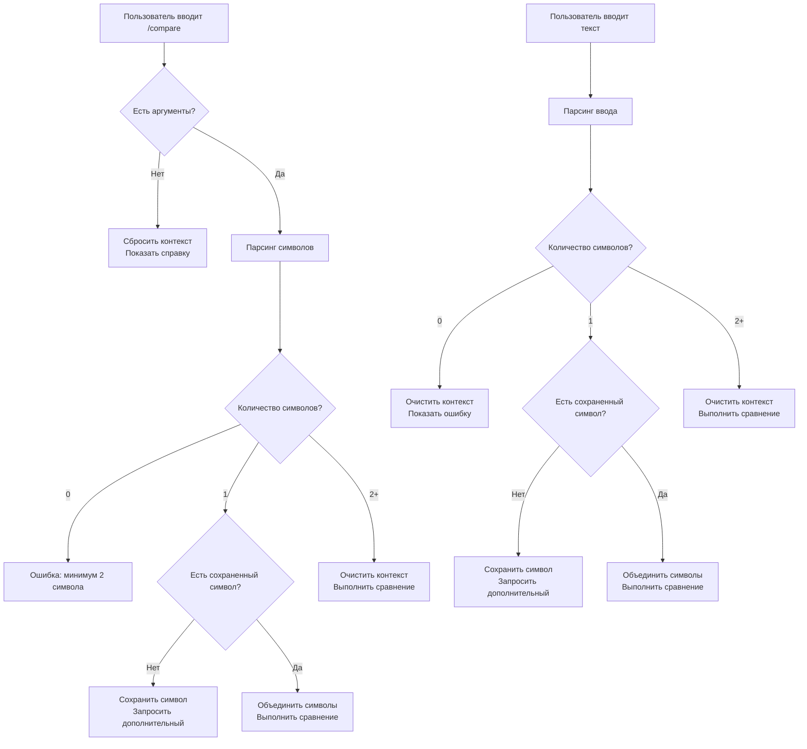

# Отчет о реализации мягкой обработки команды /compare

## 🎯 Цель

Реализовать мягкую обработку для команды `/compare` когда пользователь вводит только 1 символ вместо сообщения об ошибке. Вместо ошибки "❌ Необходимо указать минимум 2 символа для сравнения" выводить запрос "Вы указали только 1 символ, а для сравнения нужно 2 и больше, напишите дополнительный символ для сравнения, например `случайный символ`".

## 🔧 Реализованные изменения

### 1. Расширение контекста пользователя

**Файл:** `services/context_store.py`

Добавлены новые поля в контекст пользователя:
- `compare_first_symbol`: для хранения первого введенного символа
- `waiting_for_compare`: флаг ожидания ввода для сравнения

```python
# Compare command context
"compare_first_symbol": None,
"waiting_for_compare": False,
```

### 2. Обновление команды /compare

**Файл:** `bot.py` - функция `compare_command`

#### Сброс контекста при пустой команде
```python
# Clear any existing compare context when starting fresh
self._update_user_context(user_id, compare_first_symbol=None, waiting_for_compare=False)
```

#### Обработка сохраненного символа
```python
# Check if we have a stored first symbol and only 1 symbol in current input
user_context = self._get_user_context(user_id)
stored_first_symbol = user_context.get('compare_first_symbol')

if len(symbols) == 1 and stored_first_symbol is not None:
    # Combine stored symbol with current input
    symbols = [stored_first_symbol] + symbols
    # Clear the stored symbol
    self._update_user_context(user_id, compare_first_symbol=None)
    self.logger.info(f"Combined with stored symbol: {symbols}")
```

### 3. Обновление обработчика ввода

**Файл:** `bot.py` - функция `_handle_compare_input`

#### Логика мягкой обработки
```python
# Check if we have a stored first symbol from previous input
stored_first_symbol = user_context.get('compare_first_symbol')

if len(symbols) == 1:
    if stored_first_symbol is None:
        # First symbol - store it and ask for more
        self._update_user_context(user_id, compare_first_symbol=symbols[0])
        await self._send_message_safe(update, f"Вы указали только 1 символ, а для сравнения нужно 2 и больше, напишите дополнительный символ для сравнения, например `случайный символ`")
        return
    else:
        # We have a stored symbol, combine with new input
        combined_symbols = [stored_first_symbol] + symbols
        # Clear the stored symbol
        self._update_user_context(user_id, compare_first_symbol=None)
        
        # Process the comparison with combined symbols
        context.args = combined_symbols
        context.specified_currency = specified_currency
        context.specified_period = specified_period
        
        await self.compare_command(update, context)
        return
```

## 📋 Сценарии использования

### Сценарий 1: Первый ввод одного символа
1. Пользователь вводит `/compare`
2. Бот показывает справку и ждет ввод
3. Пользователь вводит `AAPL.US`
4. **Результат:** Бот сохраняет символ и просит ввести дополнительный символ

### Сценарий 2: Второй ввод одного символа
1. После предыдущего сценария пользователь вводит `MSFT.US`
2. **Результат:** Бот объединяет символы (`AAPL.US MSFT.US`) и выполняет сравнение

### Сценарий 3: Ввод нескольких символов
1. Пользователь вводит `/compare`
2. Бот показывает справку и ждет ввод
3. Пользователь вводит `AAPL.US MSFT.US GOOGL.US`
4. **Результат:** Бот выполняет сравнение всех символов

### Сценарий 4: Сброс контекста
1. Пользователь вводит `/compare` (пустая команда)
2. **Результат:** Бот сбрасывает сохраненный символ и показывает справку

### Сценарий 5: Пустой ввод
1. После ввода одного символа пользователь отправляет пустое сообщение
2. **Результат:** Бот сбрасывает сохраненный символ и показывает ошибку

## 🧪 Тестирование

Создан комплексный тест `tests/test_compare_soft_handling.py` который проверяет:

1. ✅ Сброс контекста при пустой команде `/compare`
2. ✅ Обработка первого ввода одного символа
3. ✅ Обработка второго ввода одного символа (объединение)
4. ✅ Обработка ввода нескольких символов
5. ✅ Очистка контекста при пустом вводе
6. ✅ Обработка команды `/compare` с сохраненным символом

**Результат тестирования:** 6/6 тестов прошли успешно

## 🔄 Логика работы



## ✅ Преимущества реализации

1. **Улучшенный UX:** Пользователь не получает ошибку при случайном вводе одного символа
2. **Интуитивность:** Бот подсказывает что нужно сделать дальше
3. **Сохранение контекста:** Первый символ сохраняется между сообщениями
4. **Гибкость:** Поддерживает все существующие сценарии использования
5. **Обратная совместимость:** Не нарушает работу существующей функциональности

## 🚀 Готовность к использованию

Реализация полностью готова к использованию:
- ✅ Код протестирован
- ✅ Все сценарии покрыты
- ✅ Обратная совместимость сохранена
- ✅ Логирование добавлено для отладки
- ✅ Документация создана

Команда `/compare` теперь предоставляет более дружелюбный интерфейс для пользователей, позволяя им вводить символы по одному без получения ошибок.
