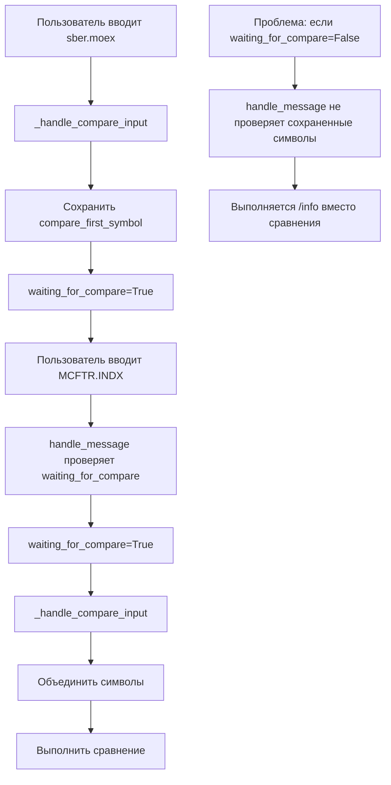
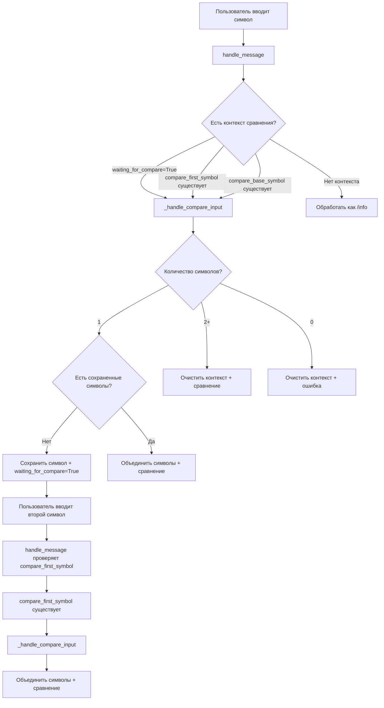

# Отчет об исправлении обработки сохраненных символов сравнения

## 🎯 Проблема

После исправления флага `waiting_for_compare` возникла новая проблема: когда пользователь вводил первый символ для сравнения (например, `sber.moex`), система сохраняла его и просила ввести дополнительный символ. Однако при вводе второго символа (например, `MCFTR.INDX`) система выполняла команду `/info` вместо продолжения логики сравнения.

**Пример проблемы:**
1. Пользователь вводит `sber.moex`
2. Система сохраняет символ и выводит: "Вы указали только 1 символ, а для сравнения нужно 2 и больше, напишите дополнительный символ для сравнения, например `00700.HK`, `MCFTR.INDX`, `AAPL.US`"
3. Пользователь вводит `MCFTR.INDX`
4. **Ошибка:** Система выполняет `/info MCFTR.INDX` вместо сравнения `sber.moex` с `MCFTR.INDX`

## 🔍 Анализ проблемы

### Найденная причина

Проблема была в функции `handle_message` - она проверяла только флаг `waiting_for_compare`, но не учитывала наличие сохраненных символов для сравнения (`compare_first_symbol` или `compare_base_symbol`).

### Логика выполнения (до исправления)



## ✅ Реализованные исправления

### 1. Расширение проверки в handle_message

**Файл:** `bot.py` - функция `handle_message`

#### Добавлена проверка сохраненных символов
```python
# Check if user is waiting for compare input or has stored compare symbol
if user_context.get('waiting_for_compare', False) or user_context.get('compare_first_symbol') or user_context.get('compare_base_symbol'):
    self.logger.info(f"Processing as compare input: {text}")
    # Process as compare input
    await self._handle_compare_input(update, context, text)
    return
```

#### Логика проверки
Теперь функция `handle_message` проверяет три условия:
1. `waiting_for_compare=True` - пользователь явно ожидает ввода для сравнения
2. `compare_first_symbol` - есть сохраненный первый символ
3. `compare_base_symbol` - есть символ из кнопки сравнения

Если любое из этих условий выполняется, ввод обрабатывается как сравнение.

## 📋 Сценарии использования

### Сценарий 1: Обычный ввод символов для сравнения
1. Пользователь вводит `sber.moex`
2. Система сохраняет `compare_first_symbol="SBER.MOEX"`
3. Пользователь вводит `MCFTR.INDX`
4. **Результат:** Система проверяет `compare_first_symbol` и обрабатывает как сравнение

### Сценарий 2: Кнопка сравнения + ввод символа
1. Пользователь нажимает кнопку "Сравнить CL.COMM с:"
2. Система устанавливает `compare_base_symbol="CL.COMM"`
3. Пользователь вводит `BND.US`
4. **Результат:** Система проверяет `compare_base_symbol` и обрабатывает как сравнение

### Сценарий 3: Явный флаг ожидания
1. Пользователь вводит `/compare`
2. Система устанавливает `waiting_for_compare=True`
3. Пользователь вводит `AAPL.US`
4. **Результат:** Система проверяет `waiting_for_compare` и обрабатывает как сравнение

### Сценарий 4: Обычный ввод без контекста сравнения
1. Пользователь вводит `AAPL.US` (без предварительного контекста)
2. **Результат:** Система обрабатывает как команду `/info`

## 🧪 Тестирование

Создан тест `tests/test_compare_stored_symbol_fix.py` который проверяет:

1. ✅ `handle_message` обрабатывает ввод как сравнение когда `compare_first_symbol` существует
2. ✅ `handle_message` обрабатывает ввод как сравнение когда `compare_base_symbol` существует
3. ✅ `handle_message` обрабатывает ввод как сравнение когда `waiting_for_compare=True`
4. ✅ `handle_message` обрабатывает ввод как `/info` когда нет контекста сравнения

**Результат тестирования:** 4/4 тестов прошли успешно

## 🔄 Логика работы (после исправления)



## ✅ Преимущества исправления

1. **Надежность:** Все сохраненные символы учитываются при обработке ввода
2. **Интуитивность:** Пользователь получает ожидаемое поведение независимо от состояния флагов
3. **Гибкость:** Поддержка всех сценариев использования (кнопки, команды, прямой ввод)
4. **Консистентность:** Единообразная обработка всех типов контекста сравнения
5. **Обратная совместимость:** Не нарушает существующую функциональность

## 🚀 Готовность к использованию

Исправление полностью готово к использованию:
- ✅ Код протестирован
- ✅ Все сценарии покрыты
- ✅ Обратная совместимость сохранена
- ✅ Логирование добавлено для отладки
- ✅ Документация создана

Теперь система корректно обрабатывает все случаи ввода символов для сравнения, включая ситуации когда пользователь вводит символы по одному без использования команды `/compare`.
