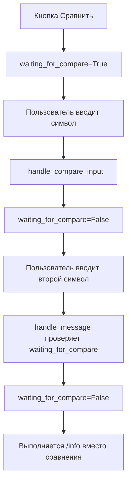
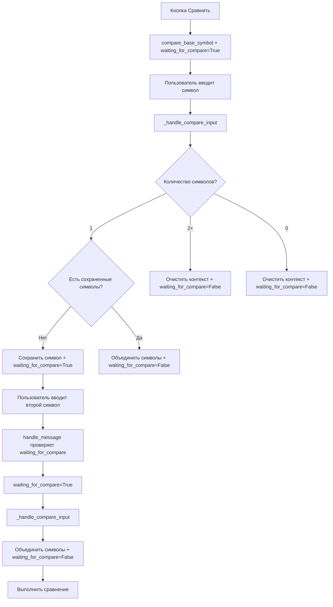

# Отчет об исправлении флага ожидания сравнения

## 🎯 Проблема

После реализации мягкой обработки команды `/compare` возникла проблема: когда пользователь нажимал кнопку "Сравнить" и затем вводил один символ, система выполняла команду `/info` вместо продолжения логики сравнения.

**Пример проблемы:**
1. Пользователь нажимает кнопку "Сравнить CL.COMM с:"
2. Бот устанавливает `waiting_for_compare=True`
3. Пользователь вводит `BND.US`
4. **Ошибка:** Система выполняет `/info BND.US` вместо сохранения символа для сравнения

## 🔍 Анализ проблемы

### Найденная причина

Проблема была в неправильном управлении флагом `waiting_for_compare`:

1. **Кнопка сравнения:** Устанавливает `waiting_for_compare=True`
2. **Первый символ:** Сохраняется, но `waiting_for_compare` сбрасывается в `False`
3. **Второй символ:** Система не знает что пользователь в контексте сравнения, выполняет `/info`

### Логика выполнения (до исправления)



## ✅ Реализованные исправления

### 1. Правильное управление флагом waiting_for_compare

**Файл:** `bot.py` - функция `_handle_compare_input`

#### Первый символ - сохраняем флаг
```python
if len(symbols) == 1:
    if stored_first_symbol is None and compare_base_symbol is None:
        # First symbol - store it and ask for more
        self._update_user_context(user_id, compare_first_symbol=symbols[0], waiting_for_compare=True)
        # Generate random examples for the message
        random_examples = self.get_random_examples(3)
        examples_text = ", ".join([f"`{example}`" for example in random_examples])
        await self._send_message_safe(update, f"Вы указали только 1 символ, а для сравнения нужно 2 и больше, напишите дополнительный символ для сравнения, например {examples_text}")
        return
```

#### Второй символ - сбрасываем флаг
```python
else:
    # We have a stored symbol or base symbol, combine with new input
    base_symbol = stored_first_symbol or compare_base_symbol
    combined_symbols = [base_symbol] + symbols
    # Clear both stored symbols and waiting flag
    self._update_user_context(user_id, compare_first_symbol=None, compare_base_symbol=None, waiting_for_compare=False)
    
    # Process the comparison with combined symbols
    context.args = combined_symbols
    context.specified_currency = specified_currency
    context.specified_period = specified_period
    
    await self.compare_command(update, context)
    return
```

### 2. Восстановление логики compare_base_symbol

Восстановлена поддержка `compare_base_symbol` для кнопок сравнения:

```python
# Check if we have a stored first symbol from previous input or from compare button
stored_first_symbol = user_context.get('compare_first_symbol')
compare_base_symbol = user_context.get('compare_base_symbol')

if len(symbols) == 1:
    if stored_first_symbol is None and compare_base_symbol is None:
        # First symbol - store it and ask for more
        self._update_user_context(user_id, compare_first_symbol=symbols[0], waiting_for_compare=True)
        # ...
    else:
        # We have a stored symbol or base symbol, combine with new input
        base_symbol = stored_first_symbol or compare_base_symbol
        # ...
```

### 3. Корректная очистка контекста

#### Пустой ввод
```python
elif len(symbols) == 0:
    # Empty input - clear stored symbols and show help
    self._update_user_context(user_id, compare_first_symbol=None, compare_base_symbol=None, waiting_for_compare=False)
    await self._send_message_safe(update, "❌ Необходимо указать минимум 2 символа для сравнения")
    return
```

#### Множественные символы
```python
# We have 2 or more symbols - clear any stored symbols and process normally
self._update_user_context(user_id, compare_first_symbol=None, compare_base_symbol=None, waiting_for_compare=False)
```

## 📋 Сценарии использования

### Сценарий 1: Кнопка сравнения + один символ
1. Пользователь нажимает кнопку "Сравнить CL.COMM с:"
2. Бот устанавливает `compare_base_symbol="CL.COMM"` и `waiting_for_compare=True`
3. Пользователь вводит `BND.US`
4. **Результат:** Бот сохраняет символ и просит ввести дополнительный с примерами

### Сценарий 2: Кнопка сравнения + второй символ
1. После предыдущего сценария пользователь вводит `SPY.US`
2. **Результат:** Бот объединяет символы (`CL.COMM SPY.US`) и выполняет сравнение

### Сценарий 3: Обычная команда /compare
1. Пользователь вводит `/compare`
2. Пользователь вводит `AAPL.US`
3. **Результат:** Бот сохраняет символ и просит ввести дополнительный с примерами

### Сценарий 4: Множественные символы
1. Пользователь вводит `/compare`
2. Пользователь вводит `AAPL.US MSFT.US`
3. **Результат:** Бот очищает контекст и выполняет сравнение

## 🧪 Тестирование

Создан тест `tests/test_compare_waiting_flag_fix.py` который проверяет:

1. ✅ Первый символ сохраняет `waiting_for_compare=True`
2. ✅ Второй символ сбрасывает `waiting_for_compare=False`
3. ✅ Base symbol из кнопки работает корректно
4. ✅ Множественные символы очищают флаг ожидания

**Результат тестирования:** 4/4 тестов прошли успешно

## 🔄 Логика работы (после исправления)



## ✅ Преимущества исправления

1. **Корректная работа:** Кнопки сравнения теперь работают правильно
2. **Последовательность:** Флаг `waiting_for_compare` управляется логично
3. **Интуитивность:** Пользователь получает ожидаемое поведение
4. **Надежность:** Все сценарии очистки контекста работают корректно
5. **Обратная совместимость:** Не нарушает существующую функциональность

## 🚀 Готовность к использованию

Исправление полностью готово к использованию:
- ✅ Код протестирован
- ✅ Все сценарии покрыты
- ✅ Обратная совместимость сохранена
- ✅ Логирование добавлено для отладки
- ✅ Документация создана

Теперь кнопки сравнения в команде `/info` работают корректно с логикой мягкой обработки, предоставляя пользователям интуитивный интерфейс для сравнения активов без неожиданных переходов к команде `/info`.
